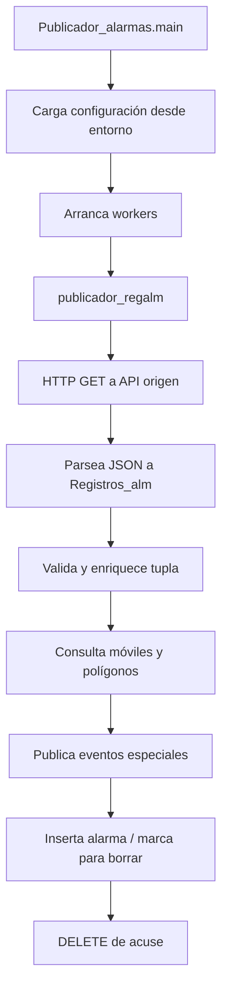

# publicador_alarmas

`publicador_alarmas` es un servicio Java de ejecución continua que consulta registros desde una API origen, valida cada lectura, resuelve datos auxiliares contra servicios HTTP y PostgreSQL, publica eventos especiales y persiste alarmas asociadas al flujo operativo.

Este repositorio está en proceso de modernización: hoy ya usa Maven, Docker, variables de entorno y logs estructurados en logfmt. El objetivo del refactor es dejarlo listo para una base más limpia y actualizable sin perder compatibilidad con el comportamiento legado.

## Estado actual

- Runtime: Java 25
- Build: Maven
- Empaquetado: JAR ejecutable
- Entrada principal: `com.position.publicador_alarmas.Publicador_alarmas`
- Ejecución: workers infinitos por proceso, uno por rango de trabajo

## Flujo general



## Estructura del repositorio

- `src/main/java/com/position/publicador_alarmas/` — código fuente principal
- `src/test/java/com/position/publicador_alarmas/` — pruebas unitarias
- `pom.xml` — dependencias, plugins y build Maven
- `compose.yaml` / `compose.local.yaml` — despliegue con Docker Compose
- `.env.example` — plantilla de configuración por bloques
- `Dockerfile` — imagen del worker

## Comandos útiles

```bash
mvn clean package
```

Compila el proyecto y genera el JAR en `target/`.

```bash
mvn test
```

Ejecuta la suite de pruebas unitarias.

```bash
docker compose -f compose.local.yaml up -d
```

Levanta el worker en local usando `.env`.

## Configuración

La aplicación lee la configuración desde variables de entorno. Toma como base `.env.example` y crea un `.env` local fuera de control de versiones.

No se deben versionar secretos, credenciales, archivos generados ni `target/`.

## Logging

El proyecto mantiene los logs legacy mientras se completa la migración, pero ya agrega trazas estructuradas en logfmt para seguimiento de workers, polling, requests HTTP y decisiones de procesamiento. No se registran payloads completos ni secretos.

## Pruebas

Las pruebas viven junto al código en `src/test/java` y usan JUnit 5 y AssertJ. Antes de abrir un PR conviene ejecutar:

```bash
mvn test
```

Si agregas cambios en HTTP, mapeo o configuración, añade o ajusta tests en el mismo paquete que el código afectado.

## Casos de uso y verificación

La documentación operativa del comportamiento real está en `docs/test-cases/`.
Ahí se enumeran los flujos que sí se pueden reproducir hoy, con sus
precondiciones, señales de éxito y validación mínima. El mapa de brechas y
mejoras pendientes está en `docs/improvement-roadmap.md`.

Casos cubiertos:

- lectura de lote desde la API origen
- validación y rechazo de registros
- resolución de móvil y polígono
- publicación de evento especial
- inserción GPS cuando corresponde
- marcado y limpieza de ACK
- abortos del worker y fallas de infraestructura

## Contribución

Usa commits cortos y descriptivos, idealmente con convención conventional commits. Para cambios grandes, trabaja en una rama de refactor y abre PR con:

- qué cambió
- por qué cambió
- qué problema resuelve
- cómo se validó
